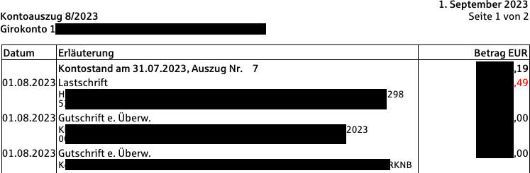
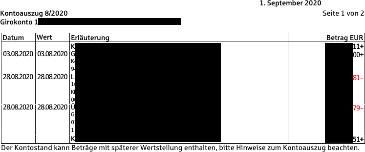
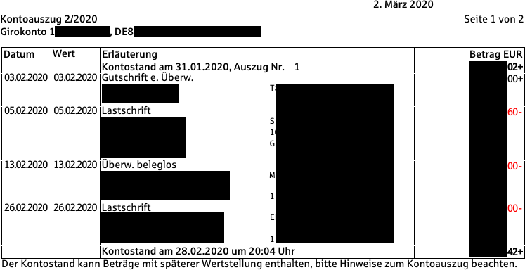

~~~~~~~~~~~~~~~~~~~~~~~~~~~~~~~~
Sparkase plugin for ofxstatement
~~~~~~~~~~~~~~~~~~~~~~~~~~~~~~~~

This project provides a plugin for ofxstatement that imports German Sparkasse PDF statements.

`ofxstatement`_ is a tool to convert proprietary bank statement to OFX format, suitable for importing to GnuCash and other programs.

.. _ofxstatement: https://github.com/kedder/ofxstatement

If you encounter any errors when using this plugin, feel free to open an issue.
It is expected that the payee of transactions is not extracted for recent PDFs since these mix the payee and the memo.
You should use the official CSV export instead of this tool whenever possible.

The plugin was tested on the following PDF layouts:

    New one-column view (used currently)

    One-column view (used up to Kontoauszug 10/2021)

    Two-column view (used up to Kontoauszug 7/2020)

Development
===========
Run ``pipenv shell``.
